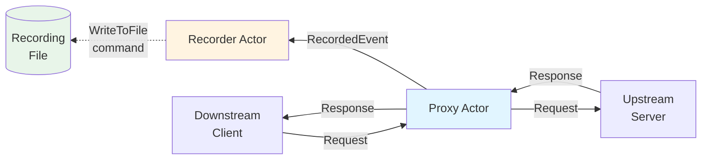
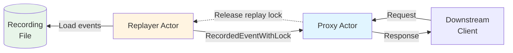

# Macaw

A record/replay tool for different protocols, built with Rust using an actor-based architecture.

## Summary

Macaw is a protocol-agnostic record/replay framework that allows you to:
- **Record** network traffic between clients and servers by proxying connections
- **Replay** recorded sessions without requiring the original upstream servers

The tool supports multiple protocols (HTTP, WebSocket, and extensible to others) and provides a clean separation between protocol-specific logic and the core recording/replay engine.

## Usage

### Recording

Create a recorder instance, add proxies for the protocols you want to record, and save the recording when done:

```rust
use macaw::core::*;
use macaw::http::*;
use macaw::ws::*;

let mut macaw = Macaw::recorder();

macaw.add_http_proxy("http_demo", "127.0.0.1:8800", "https://httpbin.org/", HttpProxyOptions::default()).await?;
macaw.add_ws_proxy("ws_demo", "127.0.0.1:8801", "wss://echo.websocket.org/", HttpProxyOptions::default()).await?;

tokio::spawn({
    let handle = macaw.exit_handle();
    async move {
        wait_for_signal().await?;
        handle.exit();
        Ok::<(), anyhow::Error>(())
    }
});

macaw.record_when_exit("./data/record.json").await?;
```

### Replaying

Load a recording file and replay it through proxies:

```rust
use macaw::core::*;
use macaw::http::*;
use macaw::ws::*;

let mut macaw = Macaw::replayer("./data/record.json")?;

macaw.add_http_proxy("http_demo", "127.0.0.1:8800", HttpProxyOptions::default()).await?;
macaw.add_ws_proxy("ws_demo", "127.0.0.1:8801", WsProxyOptions::default()).await?;

macaw.play()?;

macaw.wait_until_stopped().await?;
```

## CLI

The `macaw` binary provides record and replay commands driven by a TOML config file:

```bash
# Record (proxies from macaw.toml)
macaw record ./data/record.json

# Replay
macaw replay ./data/record.json

# With debug mode (one-line traffic per message)
macaw -d record ./data/record.json
macaw -d replay ./data/record.json

# Custom config file
macaw -c my_config.toml record ./data/record.json
```

### Config file (macaw.toml)

```toml
[proxies.http_demo]
type = "http"
bind = "127.0.0.1:8800"
target = "https://httpbin.org/"   # required for record, ignored for replay
overrides = "./overrides/http.json"  # optional

[proxies.ws_demo]
type = "ws"
bind = "127.0.0.1:8801"
target = "wss://echo.websocket.org/"
overrides = "./overrides/ws.json"
```

Recording stops and saves when you press Ctrl+C or kill the process.

### Control server and client

Run a long-lived control server over TCP or a Unix socket:

```bash
macaw serve --tcp 127.0.0.1:8080
macaw serve --unix /tmp/macaw.sock
```

Use `macaw client` (or its `macaw ctl` alias) to manage profiles and sessions:

```bash
macaw client profile create development --file config/macaw.toml
macaw client session record development --name test-run --output recordings/test.json
macaw client session list --profile development
macaw client watch <session-id>
macaw client session stop <session-id>
```

Pass `--url http://host:port` or `--unix /path/to/socket` before the client
subcommand. `MACAW_CONTROL_URL` and `MACAW_CONTROL_UNIX` provide equivalent
defaults. Use `-o json` for scripts, or stream newline-delimited events with
`watch --format jsonl`.

The foreground workflow creates a session, displays its proxy endpoints,
watches traffic, and stops and flushes the session on Ctrl+C:

```bash
macaw client run record development --output recordings/test.json
macaw client run replay development --recording recordings/test.json
```

Watch streams the same typed entries used by recording files. Pretty output is
rendered client-side through each event type's debug formatter, while
`watch --format jsonl` emits raw recording entries. `watch --headers` displays
headers exposed by the event. Traffic uses a bounded live stream; a slow client
receives a `dropped_events` notification instead of blocking proxy traffic.

## Building

```bash
cargo build --release
```

## Running Examples

```bash
# Run recorder example
cargo run --example recorder

# Run replayer example
cargo run --example replayer
```

## WebAssembly

With the optional `wasm` feature, HTTP transform and redaction hooks can be
implemented as WebAssembly Components while native Rust hooks remain available.
Macaw includes a sandboxed WASI 0.2 host and supports plugins written in
languages such as Python and Rust.

The [`examples/wasm`](examples/wasm) directory contains a complete recorder host
and equivalent Python and Rust signing plugins. To build the Python guest and
run it:

```bash
make -C examples/wasm/python build
cargo run --release --example wasm --features wasm -- \
  examples/wasm/python/target/http-auth-plugin-python.wasm
```

See [`examples/wasm/README.md`](examples/wasm/README.md) for prerequisites,
the Rust guest, and full usage instructions.

## Architecture

### Terminology

- **Downstream**: The client side (clients connect "down" to the proxy).
  In recording mode, downstream clients connect to the proxy, and their traffic is recorded. In replay mode, downstream clients connect and receive replayed responses.

- **Upstream**: The server side (the proxy forwards "up" to the origin server).
  The proxy forwards downstream requests to upstream servers and records both the requests and responses.

### macaw-core

The `macaw-core` crate provides the generic recording/replay infrastructure:

- **Actor System**: Core actor traits, messaging, and lifecycle management
- **Recorder**: Collects `RecordedEvent` messages from proxies through channels and stores them in an `EventStore`. When requested, it writes all events to a JSON file.
- **Replayer**: Loads recorded events from a JSON file and distributes them to registered proxies via channels. It manages replay locks to ensure events are replayed in the correct order.
- **Event Model**: Generic `RecordEvent` trait that protocol-specific events implement, allowing type-erased storage and replay
- **Storage**: File I/O for reading/writing recording files in JSON format

Key components:
- `Recorder`: Actor that receives `RecordedEvent` messages and saves them
- `Replayer`: Actor that loads events and sends `RecordedEventWithLock` to proxies
- `RecordedEvent`: Wraps a protocol-specific event with a `proxy_id`
- `RecordedEventWithLock`: Includes a replay lock to coordinate replay timing

#### Actor Model

Macaw uses an actor-based architecture where:

- **Actors** are independent components that communicate through channels
- **Messages** are sent via `send()` for fire-and-forget operations
- **Requests** are sent via `request()` for operations that require a response
- Each actor runs in its own task and processes messages sequentially
- Actors can spawn child actors and manage their lifecycle

The actor system provides:
- Type-safe message passing through channels
- Request/reply patterns for synchronous operations
- Graceful shutdown and error handling
- Lifecycle management (start, stop, error handling)


### macaw-*

Protocol-specific crates (e.g., `macaw-http`, `macaw-ws`) implement:

- **Protocol Logic**: Handle protocol-specific details (parsing, framing, etc.)
- **Data Schema**: Define protocol-specific event types that implement `RecordEvent`
- **Proxy Actors**: Implement `ProxyActor` trait and handle both recording and replay modes

#### Redact / Transform / Overrides

Proxies support three mechanisms for modifying requests and responses:

- **Redact**: Removes or masks sensitive or nondeterministic data from requests before recording or matching during replay. This ensures that requests with varying signatures, timestamps, or other dynamic values can be properly matched. For example, redacting authentication headers allows replaying recordings even when credentials change.

- **Transform**: Encodes/decodes requests and responses when they cross the proxy boundary (between downstream clients and upstream servers). This enables custom transformations like request signing, custom compression/decompression, or protocol translation. Transformations are applied bidirectionally: `decode_*` methods process incoming data, while `encode_*` methods process outgoing data.

- **Overrides**: Declarative JSON or YAML rules (match + action) applied during recording and replay. Match on method, path, body, headers (HTTP) or message content (WebSocket) via regex; actions can replace values, search-and-replace with capture groups, set headers, or suppress messages (WebSocket only). Supports optional rules. Use cases: redact secrets, normalize dynamic values for deterministic replay, filter noisy messages.

##### Overrides (JSON/YAML DSL)

Override rules are defined in a JSON or YAML file and loaded via proxy options. Format is detected by file extension (`.json`, `.yaml`, `.yml`); files without a recognized extension try JSON first, then YAML. Each rule has a `match` (regex on protocol-specific fields) and an `action` (replace, search-and-replace, or suppress). Rules are chained and applied in order. The core framework lives in `macaw-core`; HTTP and WebSocket crates provide protocol-specific rule types (`HttpRequest`, `HttpResponse`, `WsUpstreamMessage`, `WsDownstreamMessage`).

**HTTP examples:**

```json
[
  {"HttpRequest": {"match": {"body": "secret.*"}, "action": {"body": "REDACTED"}}},
  {"HttpRequest": {"match": {"headers": {"authorization": "Bearer .*"}}, "action": {"headers": {"authorization": "Bearer REDACTED"}}}},
  {"HttpRequest": {"match": {"body": "id_(?P<id>\\d+)"}, "action": {"body": {"search": "id_(?P<id>\\d+)", "replace": {"id": "XXX"}}}}},
  {"HttpResponse": {"match": {"request": {"path": "/api/users", "method": "POST"}}, "action": {"body": {"search": "user_id=(\\d+)", "replace": "user_id=REDACTED"}}}}
]
```

**WebSocket examples:**

```json
[
  {"WsUpstreamMessage": {"match": {"message": "secret.*"}, "action": {"message": "REDACTED"}}},
  {"WsDownstreamMessage": {"match": {"message": "error.*"}, "action": {"message": "OVERRIDDEN_ERROR"}}},
  {"WsUpstreamMessage": {"match": {"message": "drop_me"}, "action": "ignore"}}
]
```

The `"action": "ignore"` form suppresses the message (WebSocket only).

**YAML equivalent** (use `!Tag` for rule types):

```yaml
- !WsUpstreamMessage
  match:
    message: "secret.*"
  action:
    message: "REDACTED"
- !WsUpstreamMessage
  match:
    message: "drop_me"
  action: ignore
```

#### Recording Mode




In recording mode, proxies:
1. Accept downstream connections
2. Forward requests/responses to upstream servers
3. Send `RecordedEvent` messages to the `Recorder` actor via channels
4. Record both downstream and upstream traffic

#### Replay Mode



In replay mode, proxies:
1. Accept downstream connections
2. Receive `RecordedEventWithLock` messages from the `Replayer` actor
3. Hold replay locks until downstream requests match recorded requests
4. Send recorded responses back to downstream clients

Example (HTTP):
- When a downstream request arrives, the proxy matches it with a recorded request
- The proxy holds the replay lock until the match is found
- Once matched, the proxy sends the recorded response back to the downstream client
- The replay lock ensures responses are sent in the correct order relative to other events

This pattern allows protocols like HTTP (request/response) to work correctly in replay mode, where responses need to be sent back to waiting downstream clients.


## License

Licensed under the MIT license ([LICENSE](LICENSE) or http://opensource.org/licenses/MIT).
